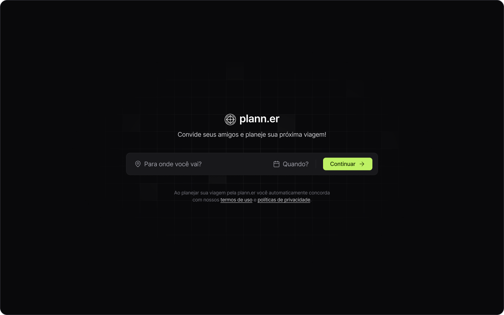

<h1 align="center"> plann.er </h1>

Projecto da NLW Journey, promovido pela Rocketseat para ensino de tecnologias WEB.  

  <a href="#-tecnologias">Tecnologias</a>&nbsp;&nbsp;&nbsp;|&nbsp;&nbsp;&nbsp;
  <a href="#-projeto">Projeto</a>&nbsp;&nbsp;&nbsp;|&nbsp;&nbsp;&nbsp;
  <a href="#-layout">Layout</a>&nbsp;&nbsp;&nbsp;|&nbsp;&nbsp;&nbsp;
  <a href="#memo-licença">Licença</a>

  

 

  

## 🚀 Tecnologias

Esse projeto foi desenvolvido com as seguintes tecnologias:

- Vite
- React
- TypeScript
- Git e Github
- Figma

## 💻 Projeto

O plann.er é uma app para plenejar as suas viagens, convidar amigos

- [Acesse o projeto finalizado, online](https://github.com/leusonguenha/plann.er)

## 🔖 Layout

Você pode visualizar o layout do projeto através [DESSE LINK](<https://www.figma.com/design/lpbpHXQJQhrjGLOitOBUUz/NLW-Journey-%E2%80%A2-Planejador-de-viagem-(Community)?node-id=7101-739&t=LWloTiauwjpchYUQ-0>). É necessário ter conta no [Figma](https://figma.com) para acessá-lo.

## :memo: Licença

Esse projeto está sob a licença MIT.
